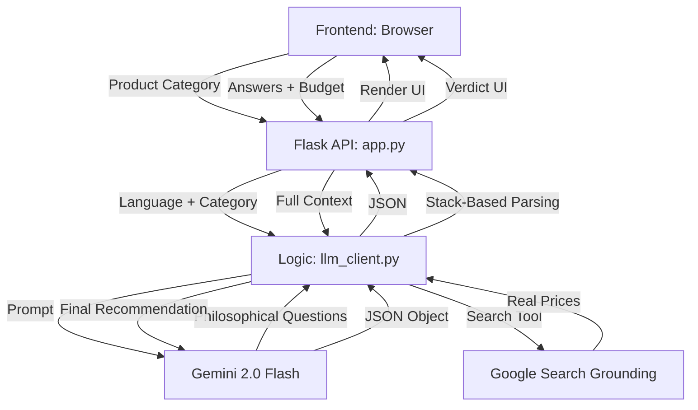

# Philosophy-Based Decision Maker 🧠⚖️

This project is a sophisticated AI-driven decision assistant that transcends simple specifications. It uses philosophical inquiry to understand a user's core values before providing a grounded, real-time recommendation.

---

## 🏛️ Project Goal

Standard decision tools ask about "RAM" or "Storage." This project asks: **"Do you buy for utility or status?"** It helps users align their purchases with their intent, while ensuring the final choice respects hard budgetary and functional constraints by fetching **Real-World Prices** via Google Search.

---

## 🏗️ System Architecture

The application follows a modern client-server architecture with an AI transformation layer.

### 1. Frontend (Presentation Layer)
- **Tech Stack**: Vanilla HTML5, CSS3, JavaScript.
- **Cinematic Design**: Uses a custom CSS animation system and a background video overlay for a premium, "High-Tech" feel.
- **State Management**: Handled in `script.js`. It manages the quiz lifecycle, answer accumulation, and multi-language/currency switching.
- **Localization**: Supports multiple languages (English, Hindi, Urdu, etc.) with dynamic RTL (Right-to-Left) switching for appropriate scripts.

### 2. Backend (API Layer)
- **Tech Stack**: Python, Flask.
- **Routes**:
    - `GET /`: Serves the main interface.
    - `POST /api/questions`: Triggers the LLM to generate category-specific philosophical inquiries.
    - `POST /api/verdict`: Processes user input and budget to return a grounded recommendation.

### 3. Logic Engine (AI Transformation Layer)
Located in `logic/llm_client.py`, this is the "Brain" of the project:
- **Model**: `gemini-2.0-flash` or `gemini-1.5-flash` (auto-selected based on availability).
- **Search Grounding**: Utilizes the `GoogleSearch` tool type within the Gemini SDK to verify live market prices during the verdict phase.
- **Robust Parsing**: Implements a **Stack-Based JSON Extractor** that surgically removes the valid JSON object from the LLM's response, even if the AI adds conversational noise or trailing text.
- **Adapter Pattern**: Converts flat AI responses into the complex nested JSON expected by the frontend UI.

---

## 📁 Key File Structure

- `app.py`: Entry point for the Flask server.
- `logic/llm_client.py`: Core AI logic and external tool integration.
- `static/js/script.js`: Client-side logic and UI rendering.
- `static/css/style.css`: Project styling and animations.
- `templates/index.html`: Main HTML structure with video container.
- `Dockerfile`: Configuration for containerized deployment (e.g., Google Cloud Run).

---

## 🚀 Key Features

- **Dynamic Value Discovery**: Questions are generated live based on the product (e.g., Laptops get different philosophical questions than Coffee).
- **Budget Respect**: The AI refuses to recommend products significantly above the user's defined "Hard Limit."
- **Real-Time Accuracy**: Prices are not "hallucinated"; they are fetched from the web at the moment of the decision.
- **Multi-Currency Support**: Handles INR, USD, PKR, and more, automatically adjusting search queries accordingly.
